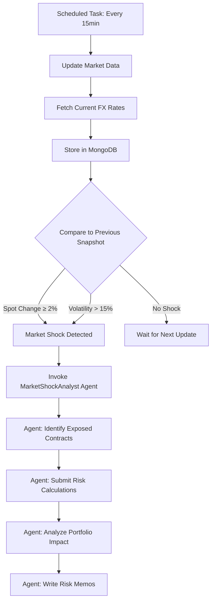

# MarketShockAnalyst Integration Summary

## Overview

The `MarketShockAnalyst` agent is now **fully integrated** into the Contract Risk Sentinel platform's orchestrator. It automatically detects market shocks and performs portfolio-wide risk reassessment.

## Integration Points

### 1. Agent Deployment
- **Location**: [scripts/deploy_foundry_agents.py](scripts/deploy_foundry_agents.py#L153)
- **Status**: ✅ Deployed automatically via `deploy.ps1`
- **Configuration**: Pre-configured with all three MCP tool servers (contracts, risk, market)

### 2. Market Shock Detection
- **Location**: [apps/agent-orchestrator/src/orchestrator.py](apps/agent-orchestrator/src/orchestrator.py#L212)
- **Status**: ✅ Now called after every market data update
- **Triggers**:
  - **Spot Movement**: When FX rate changes by ≥ 2% (configurable via `MARKET_SHOCK_THRESHOLD`)
  - **Volatility Spike**: When volatility exceeds 15%

### 3. Automatic Invocation
- **Frequency**: Every 15 minutes (via scheduled market data updates)
- **Process Flow**:
  1. Market data update runs (`update_market_data()`)
  2. Current data compared to previous snapshot
  3. If shock detected → `MarketShockAnalyst` invoked
  4. Agent analyzes impact and writes risk memos

## How It Works



## Agent Workflow

When invoked, the `MarketShockAnalyst` performs these steps:

1. **Identify Exposed Contracts**
   - Uses `search_contracts()` to find contracts with exposure to shocked currency pairs
   
2. **Submit Risk Recalculations**
   - Calls `run_fx_var()` or `run_ir_dv01()` for each affected contract
   - Tracks job_ids for polling
   
3. **Poll for Results**
   - Uses `get_risk_result(job_id)` until all jobs complete
   
4. **Analyze Portfolio Impact**
   - Aggregates total VaR and DV01 exposure
   - Identifies contracts with highest sensitivity
   - Compares to pre-shock risk levels
   
5. **Generate Risk Memos**
   - Uses `write_risk_memo()` for critical contracts
   - Creates portfolio-level summary memo
   
6. **Prioritize Actions**
   - Flags contracts exceeding emergency thresholds
   - Recommends hedging strategies

## Configuration

### Adjust Market Shock Threshold

```bash
# Change threshold from 2% to 2.5%
kubectl set env deployment/agent-orchestrator -n tools \
    MARKET_SHOCK_THRESHOLD=2.5
```

### Monitor Agent Execution

```bash
# View orchestrator logs
kubectl logs -n tools deployment/agent-orchestrator --follow

# Check for market shock detections
kubectl logs -n tools deployment/agent-orchestrator | grep "Market Shock"
```

### View Agent Output

- **Azure AI Foundry Portal**: Agents → MarketShockAnalyst → Execution History
- **Risk Memos**: Stored in MongoDB via MCP contracts service

## Testing

### Manual Test: Simulate Market Shock

You can test the integration by:

1. Manually updating market data with a large change
2. Waiting for the next 15-minute update cycle
3. Observing the orchestrator logs for shock detection

### Force Immediate Test

```bash
# Restart orchestrator to trigger immediate market update and scan
kubectl rollout restart deployment/agent-orchestrator -n tools
kubectl logs -n tools deployment/agent-orchestrator --follow
```

## Recent Changes

The following changes were made to complete the integration:

### 1. Added Market Shock Detection Call
**File**: `apps/agent-orchestrator/src/orchestrator.py`

After market data updates, the system now:
- Retrieves current market snapshot
- Calls `detect_market_shock()` with snapshot data

### 2. Enhanced Shock Detection Logic
**File**: `apps/agent-orchestrator/src/orchestrator.py`

Improved `detect_market_shock()` to:
- Compare current data to historical snapshots in MongoDB
- Detect actual spot price movements (not just volatility)
- Store snapshots for future comparisons
- Maintain rolling window of last 100 snapshots
- Provide detailed shock context to the agent

## Next Steps

To ensure risk memos are written:

1. **Deploy Changes**
   ```bash
   # Rebuild and deploy the orchestrator
   $acr = "crriskdemo4r73ux4y2fpb"
   az acr build --registry $acr --image agent-orchestrator:latest --file .\apps\agent-orchestrator\Dockerfile .
   kubectl rollout restart deployment/agent-orchestrator -n tools
   ```

2. **Monitor Execution**
   ```bash
   kubectl logs -n tools deployment/agent-orchestrator --follow
   ```

3. **Verify Risk Memos**
   - Check MongoDB for risk memos written by the agent
   - Use MCP contracts service to query memos

## Troubleshooting

### No Shocks Detected
- Check `MARKET_SHOCK_THRESHOLD` setting (default: 2%)
- Verify market data is being updated (check logs every 15 minutes)
- Ensure MongoDB connection is working

### Agent Not Invoked
- Confirm `AZURE_AI_PROJECT_ENDPOINT` is set
- Check orchestrator has credentials to access Foundry
- Verify `MARKET_SHOCK_AGENT` environment variable matches deployed agent name

### No Risk Memos Written
- Check agent execution history in Azure AI Foundry Portal
- Verify MCP services are accessible from Foundry
- Review agent logs for MCP tool call failures

## References

- [Agent Deployment Guide](AGENTS_DEPLOYMENT.md)
- [Main README](README.md)
- [Orchestrator Source](apps/agent-orchestrator/src/orchestrator.py)
